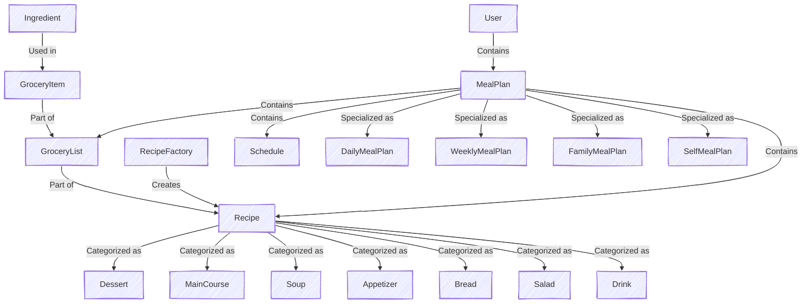

# BitBites

## Overview

BitBites is a Java-based meal planning application that generates weekly meal plans and grocery lists based on selected recipes. The system is designed with an object-oriented approach, utilizing inheritance and factory patterns to efficiently manage meal planning.

## Features

- Define **ingredients** and categorize them.
- Create **recipes** with detailed attributes (calories, servings, instructions, etc.).
- Generate meal plans of different types (daily, weekly, family).
- Create a grocery list based on selected recipes.
- Create a grocery list based on an generated meal plan.
- Use a **factory pattern** to create recipes from a URL.
- Automatically **aggregate ingredients** and handle **unit conversions**.
- **Store meal plans** for users.
- Create **user database** with hashed store password.
- Ensure meal plans meet **caloric constraints**.
- (Bonus) Provide a **web interface** for managing recipes, meal plans, and grocery lists.

---

## Project Logic

The system follows a structured approach with interconnected components. The core logic revolves around:

- **Ingredients**: Represented by simple records, categorized for easier management.
- **Grocery Items**: Defined by their ingredient, quantity, and unit, allowing aggregation and unit conversion.
- **Recipes**: Abstract representation of a meal, categorized into different types like `Dessert`, `MainCourse`, etc.
- **Recipe Factory**: Initially supports importing recipes from a single website, with future extensibility for more sources.
- **Schedule**: Defines the structure of daily meals, ensuring a balanced meal plan.
- **Meal Plans**:
    - **SelfMealPlan**: The user provides a predefined list of recipes, and no generation logic is needed.
    - **Other Meal Plans (Daily, Weekly, Family)**:
        - The user selects kitchen types and a preparation time range.
        - The system randomly picks recipes from the chosen kitchen types while ensuring the total calorie intake is balanced.
        - The **FamilyMealPlan** extends the Weekly plan by adjusting portions based on the number of people.
        - The system prevents duplicate meals and balances meal distribution throughout the week.

### Diagram Representation

The following diagram visually represents the core logic of **BitBites**:

---
## Database

- implemented using ProsgreSQL 
- needed to add some Model classes in order to make the database
  - collections and arrays from the objects are transform in foreign keys in included classes
  - added records to store the id keys and the foreign keys
- added CRUD operations on all table (different functions for tables)

### Diagram

---

## Web Interface

The BitBites web application will provide the following functionalities:

- **Create and store recipes**.
- **Generate meal plans** of any type.
- **View the grocery list** for selected meal plans.
- **See the planned meals** for the week in a calendar format.

---

## Future Improvements

- Extend **Recipe Factory** to support multiple recipe websites.
- Improve **unit conversion** for ingredient aggregation.
- Implement **user accounts** to save preferences and meal history.
- Develop a **mobile-friendly version** of the web interface.

---

## License

MIT License.